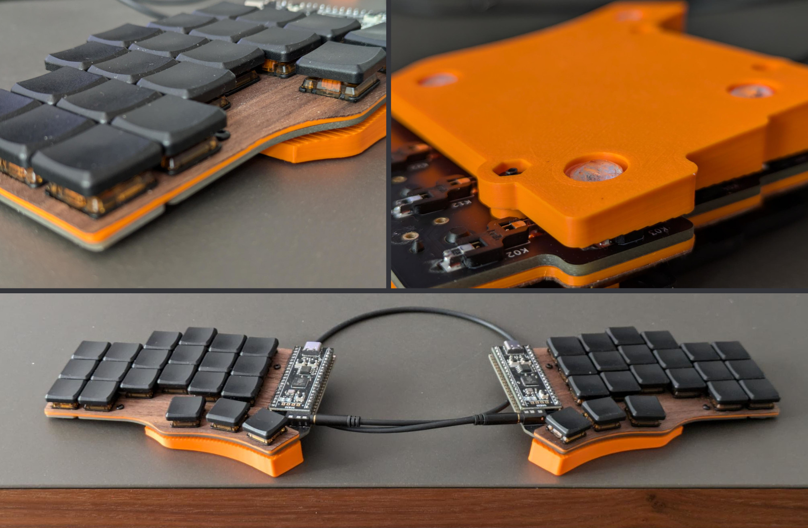

# clktmr's Piantor Build

## Files

* `stand.blend`: Blender File of the stand as shown in the image.  Make sure to
  apply modifiers before exporting to stl.
* `stand.stl`: Ready for 3D-print exported stand as shown in the image.
* `switch-plate-lasercut.blend`: 2D surface that might help in cutting the
  veneer.  Not used in my build, I just used a box-cutter to remove excess
  plywood.
* `switch-plate-thin.stl`: Ready for 3D-print exported switch plate as in the
  image.  Height is reduced by 0.6mm to account for the plywood.
* `clktmr.vil`: My personal keyboard layout in Vial's format.

## Parts

* [Piantor DIY Kit](https://shop.beekeeb.com/product/piantor-keyboard-kit/)
  without case
* 6x M2 8mm screws and nuts
* Plywood 0.6mm
